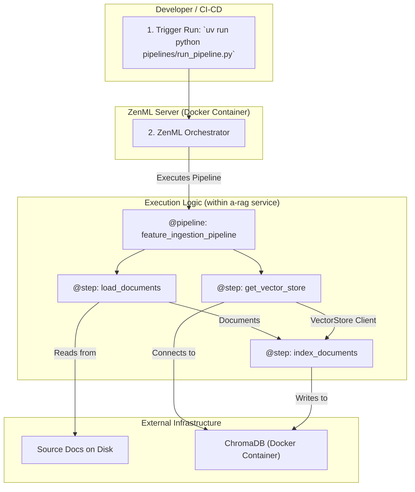

# MLOps Pipelines Guide for TGB-MicroSuite

Welcome to the MLOps guide for the `a-rag` service. This document explains the architecture, purpose, and usage of our automated Machine Learning pipelines, orchestrated by **ZenML**.

## 🎯 Philosophy: From Scripts to Pipelines

Our core principle is to treat ML processes not as one-off scripts, but as versioned, reproducible, and automated software components. The previous manual `ingest.py` script was brittle and lacked observability. By migrating to ZenML, we gain:

-   **Reproducibility:** Every pipeline run is tracked, including the code version, parameters, and inputs/outputs (artifacts).
-   **Observability:** A central dashboard (`http://localhost:8237`) provides a complete history of all runs, logs for each step, and visualization of the pipeline structure (DAG).
-   **Automation:** These pipelines are the foundation for our future CI/CD/CT (Continuous Integration/Delivery/Training) workflows.
-   **Modularity & Reusability:** Each step in a pipeline is an independent, reusable function that can be composed into different pipelines.

## 🏗️ MLOps Architecture

Our MLOps capabilities are integrated directly into the `a-rag` microservice and orchestrated by a self-hosted ZenML server managed via `docker-compose.infra.yml`.



Workflow Explanation:

    A developer or a CI/CD job triggers a pipeline run via the central CLI entry point (pipelines/run_pipeline.py).

    The ZenML client communicates the request to the ZenML Server, which begins orchestrating the pipeline.

    The pipeline definition (feature_ingestion_pipeline) dictates the execution order of the steps.

    Each step (@step) is executed as a tracked job.

        load_documents reads files from the local volume.

        get_vector_store connects to the existing ChromaDB container, reusing connection settings from src/core/config.py.

        index_documents takes the loaded documents and the vector store client, performs embedding, and ingests the data.

    All results, logs, and artifacts are tracked by the ZenML Server and visible in the UI.

🛠️ How to Use the Pipelines
Prerequisites

1. Infrastructure Must Be Running: Ensure all services are running by executing docker-compose -f docker-compose.infra.yml up -d from the project root.

2. Dependencies Installed: Navigate to services/a-rag and install the Python dependencies:

```bash
cd services/a-rag
uv venv  # Create virtual env if not present
source .venv/bin/activate
uv pip sync pyproject.toml
```

3. Connect to ZenML Server (One-time setup):
You only need to do this once. This command tells your local ZenML client where the server is.

```bash
zenml connect --url http://localhost:8237 --username default
```

## Running the Feature Ingestion Pipeline

This pipeline is the replacement for the old ingest.py script. It loads documents from a directory and indexes them into ChromaDB.

To run the pipeline, use the pipelines/run_pipeline.py script from within the services/a-rag directory.

```bash
uv run python pipelines/run_pipeline.py \
    --source-dir ../../volumes/rag-source-docs \
    --collection my_new_collection
```

Arguments:

    --source-dir (required): Path to the directory containing your source documents (e.g., .md, .txt files). The path should be relative to the a-rag service root.

    --collection (optional): The name of the ChromaDB collection to create or use. Defaults to rag_documentation_v2.

**Monitoring the Pipeline**

After triggering a run, you can monitor its progress in real-time:

    Open your browser and go to http://localhost:8237.

    Navigate to the Pipelines -> All Runs tab.

    You will see your rag_feature_ingestion_pipeline run. Click on it to see the graph, check the status of each step, and view detailed logs.

This setup provides a robust, professional framework for managing our ML workflows.