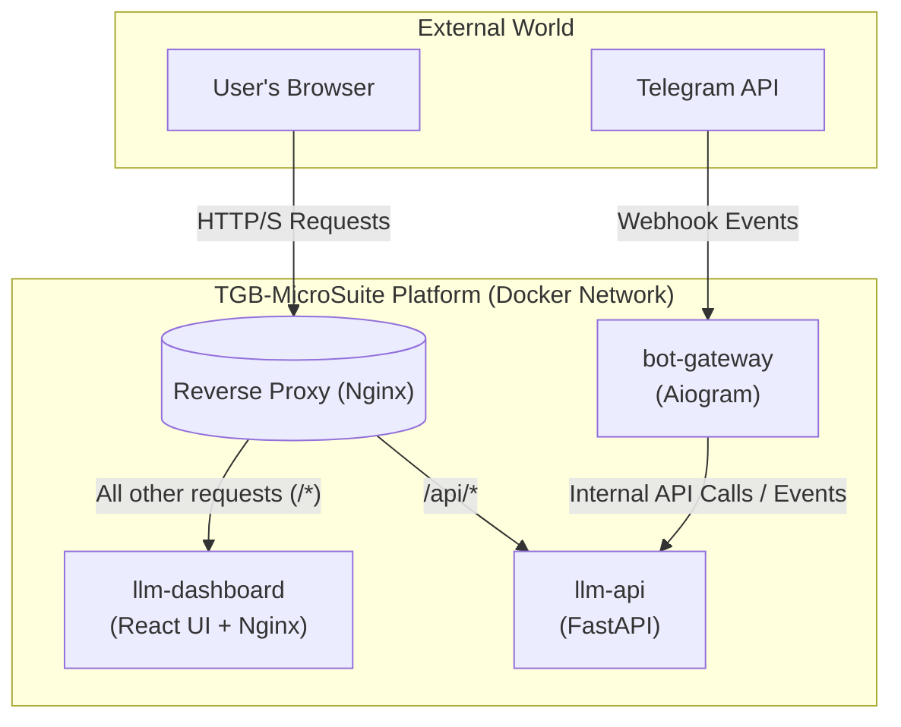

# 🛡️ Secure Telegram Bot 🕊️

[](https://opensource.org/licenses/MIT)
[](https://pypi.org/project/uv/)
[](https://www.python.org/)
[](https://docs.python.org/3/library/asyncio.html)
[](https://numpy.org/)
[](https://opencv.org/)[
[](https://www.docker.com/)  
[](https://www.sqlite.org/)
[](https://www.sqlalchemy.org/)
[](https://alembic.sqlalchemy.org/en/latest/)  
[](https://vitejs.dev/)
[](https://react.dev/)
[](https://nodejs.org/)
[](https://www.npmjs.com/)  
[](https://aiogram.dev/)
[](https://telegram.org/)
[](https://core.telegram.org/bots/api)

## 🤖 Welcome to the TGB-MicroSuite Platform

Welcome to the repository for the **TGB-MicroSuite**, a platform built with a focus on secure, ethical, and scalable interactions within the Telegram ecosystem. This project has evolved from a single bot into a modern, containerized **microservices architecture**, designed for high performance and maintainability.

> [!WARNING]
> **Important Disclaimer: Ethical Use Only**
>
> The use of this project or any part of it for fraudulent schemes, scams, or any activities that could harm or deceive individuals is **strictly forbidden**. This platform is developed with the intention of promoting peace, friendship, and positive development within the Telegram community. 🚫

## ✨ Architectural Vision & Core Principles

This project is not just a collection of code; it's an implementation of a professional engineering philosophy. Our architecture is built upon the following principles:

-   **Microservices Architecture:** The system is decomposed into small, independent, and loosely-coupled services. This allows for independent development, deployment, and scaling of each component.
-   **Clean & Scalable Code:** We adhere to principles like **Feature-Sliced Design (FSD)** on the frontend and a clear service-layer separation on the backend. This ensures the codebase remains predictable and maintainable as it grows.
-   **Infrastructure as Code (IaC):** The entire application stack, including inter-service networking, is defined declaratively in a `docker-compose.yml` file. This guarantees a reproducible environment for both development and production.
-   **Type Safety:** We use **TypeScript** on the frontend and Python type hints with Pydantic on the backend to eliminate entire classes of runtime errors and make the code self-documenting.

---

## 🏗️ System Architecture Overview

The platform consists of several independent services orchestrated by Docker Compose:



1. bot-gateway (Formerly TGramBot): The entry point for all interactions from the Telegram API. This service is responsible for receiving messages and forwarding them for processing.

2. llm-api (The LLM Backend): The core "brain" of the system. It handles business logic, interacts with the database, and processes tasks from the bot-gateway.

3. llm-dashboard (The Management Frontend): A modern React (SPA) application for managing the system, viewing data, and configuring API keys. Served by a dedicated Nginx container.

4. reverse-proxy (The System's Front Door): A central Nginx instance that acts as the single entry point for all external traffic. It intelligently routes requests to the appropriate service (llm-dashboard or llm-api), handles CORS, and is responsible for SSL termination in a production environment.

## 📂 Project Structure

The repository is organized as a monorepo, where each top-level directory represents a distinct, independent service or a shared configuration. This structure promotes high cohesion and low coupling between components.

```text
TGB-MicroSuite/
├── .github/                    # CI/CD workflows (e.g., for automated testing and deployment)
├── infra/                      # Infrastructure-as-Code (IaC) configurations
│   └── reverse-proxy/          # Nginx configurations for the main gateway
│       └── nginx.conf
│
├── services/                   # Contains the source code for all microservices
│   ├── bot-gateway/            # The service that interacts with the Telegram API
│   │   ├── src/
│   │   ├── Dockerfile
│   │   └── pyproject.toml
│   │
│   ├── llm-api/                # The core backend service (FastAPI)
│   │   ├── src/
│   │   ├── migrations/
│   │   ├── Dockerfile
│   │   └── pyproject.toml
│   │
│   └── llm-dashboard/          # The frontend management application (React)
│       ├── src/
│       ├── public/
│       ├── Dockerfile
│       ├── nginx.conf
│       └── package.json
│
├── .env.example                # Example environment variables for all services
├── docker-compose.yml          # The master file to orchestrate all services
└── README.md                   # This file                                   
```

Directory Breakdown

- infra/: This directory holds all configurations related to the project's infrastructure.
  - reverse-proxy/: Contains the Nginx configuration for our main entry point, which routes traffic to the appropriate backend or frontend service.

- services/: The heart of the project. Each sub-directory is a completely independent, containerized microservice.
  - bot-gateway/: A lightweight Python service responsible for receiving webhook events from the Telegram API and placing them into a queue or forwarding them for processing.
  - llm-api/: The main FastAPI backend. It contains all business logic, database models, and API endpoints for LLM processing and management tasks.
  - llm-dashboard/: A modern Single Page Application (SPA) built with React and TypeScript. It provides the user interface for managing and interacting with the platform. It is served by its own dedicated Nginx container for optimal performance.

- docker-compose.yml: The "glue" that holds the entire platform together. This file defines all services, networks, volumes, and environment variables, allowing the entire system to be launched with a single command.

- .env.example: A template file that documents all the necessary environment variables required to run the platform. Developers should copy this to a .env file and fill in their secrets.

## ✨ Key Advantages of This Approach

* **Modular and Maintainable (OOP):** The Object-Oriented Programming architecture promotes code reusability, organization, and easier maintenance. Each part of the bot's functionality is encapsulated within classes, making the codebase cleaner and more scalable.
* **Efficient Dependency Management (UV):** Using `uv` as the package manager ensures faster and more efficient installation of dependencies compared to traditional `pip`. This leads to quicker build times for the Docker image.
* **Simplified Deployment (Containerization):** Docker containerization packages the bot and all its dependencies into a single, portable container. This eliminates environment inconsistencies and makes deployment across different platforms seamless and reliable.
* **Scalability:** Containerization makes it easier to scale the bot horizontally by running multiple instances of the Docker container.
* **Isolation:** Docker provides a level of isolation, ensuring that the bot's dependencies do not interfere with other applications on the same system.

## 🛠️ Getting Started

Follow these steps to get your local environment up and running:

1. **Prerequisites:**
    * 🐍 Python 3.12 or higher installed on your system ([python.org](https://www.python.org/downloads/)).
    * 🐳 Docker installed on your system ([docker.com](https://www.docker.com/get-started)).
    * 📦 `uv` installed (`pip install uv`).

2. **Cloning the Repository:**

3. **Building the Docker Image:**

    ```bash
    docker build -t tgrambuddy-app -f tgrambuddy.dockerfile . 
    ```

4. **Create .env file**
   Create .env file with following format:

   ``` text
   BOT_TOKEN=<your telegram:token>
   ASYNCSQLITE_DB_URL=sqlite+aiosqlite:///data/database/tgrambuddy.db
   ```

* Make sure you do not use any quotes around your token  " or ' or any other.
* Plase .env file in the same folder with dockerfile.

5. **Running the Docker Container**
    You will need to provide your Telegram Bot token as an environment variable.

    ```bash
    # Production mode (Windows environmet)
    docker run --env-file .env -v ${PWD}/data:/app/data -d tgrambuddy-app

    # Debug mode  (Windows environmet)
    docker run --env-file .env -v ${PWD}/data:/app/data --rm -it tgrambuddy-app /bin/bash
    ```

## ☕ Support My Work

[](https://buymeacoffee.com/max.v.zaikin)
[](coming-up)

If you find this project helpful or appreciate my commitment to ethical development, consider buying me a coffee or making a donation!  
Your support helps me continue working on projects like this and contributing to a positive online environment. 🙏

Also, don't forget to:

- ⭐ Star this project on GitHub  
- 👍 Like and share if you find it useful  
- 👔 Connect with me on [LinkedIn](https://www.linkedin.com/in/maxzaikin)  
- 📢 Subscribe to my [Telegram channel](https://t.me/makszaikin) for updates and insights

## 📧 Contact & Professional Profiles

I'm always open to connecting with fellow developers, researchers, and enthusiasts. Whether you have questions, suggestions, or just want to chat about technology, feel free to reach out through any of the channels below.

| Platform      | Handle / Contact Info                                                                                              |
|---------------|--------------------------------------------------------------------------------------------------------------------|
| 📧 **Email**    | `Max.V.Zaikin@gmail.com`                                                                                           |
| 📞 **Phone**    | `+7 (914) 755-65-38`                                                                                               |
| ✈️ **Telegram** | [@makszaikin](https://t.me/makszaikin)                                                                             |
| 👔 **LinkedIn**  | [linkedin.com/in/maksim-zaikin](https://linkedin.com/in/maksim-zaikin)                                             |
| 💻 **GitHub**   | [github.com/maxzaikin](https://github.com/maxzaikin)                                                               |
| 📊 **Tableau**  | [public.tableau.com/app/profile/maksim.zaikin](https://public.tableau.com/app/profile/maksim.zaikin)               |

<br>