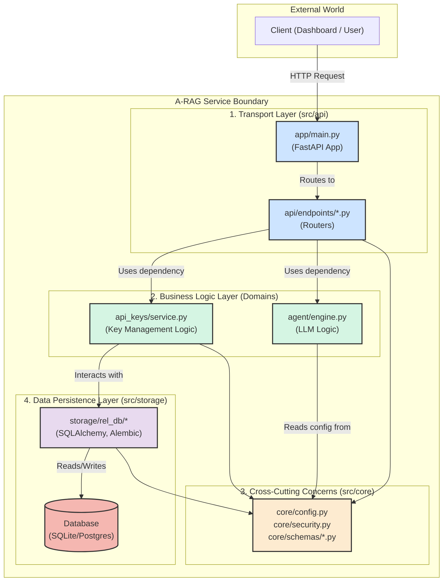

# Service: A-RAG API (`arag-api-service`)

[](https://www.python.org/)
[](https://fastapi.tiangolo.com/)
[](https://www.sqlalchemy.org/)
[](https://alembic.sqlalchemy.org/en/latest/)
[](https://github.com/astral-sh/ruff)
[](https://www.docker.com/)

This directory contains the source code for the **A-RAG API Service**(ex. TGRamLLM\backend), the core backend component of the TGB-MicroSuite platform. It is a high-performance, asynchronous API built with FastAPI.

## 🎯 Service Responsibilities

This service is the "brain" of the platform and is responsible for:

1.  **User Authentication:** Handling user login and issuing JWT access tokens.
2.  **API Key Management:** Securely creating, validating, and managing API keys for users.
3.  **LLM & RAG Processing:** Exposing endpoints that leverage an underlying Language Model (and in the future, a full RAG pipeline) to process text.
4.  **Database Interaction:** Managing all data persistence, including user information, keys, and other application-specific data.

---

## 🏛️ Architectural Design

The service is built upon a clean, domain-driven, and scalable architecture inspired by professional software engineering principles.

### Core Principles

-   **Domain-Driven Structure:** The source code inside `src/` is organized by business domains (`api`, `agent`, `storage`), not by technical layers (`routers`, `models`). This makes the codebase intuitive and easy to navigate.
-   **Dependency Inversion:** High-level domains (like `api`) do not depend on the implementation details of low-level domains (like `storage`). They depend on abstractions (services and Pydantic schemas), making the system loosely coupled and easy to test.
-   **Service Layer:** Business logic is encapsulated within service classes (e.g., `APIKeyService`), separating it from the HTTP transport layer (FastAPI routers).
-   **Clear Entry Point:** The application is launched via `src/app/main.py`, which is solely responsible for assembling the application, routers, and lifespan events.

### Internal Component Flow

This diagram illustrates how a request flows through the different domains within the `a-rag` service.



### 📂 File Structure

The internal structure of the `a-rag` service is designed for clarity and predictability.

```text
a-rag/
├── src/
│   ├── app/                # Application factory and entry point
│   │   ├── __init__.py
│   │   └── main.py         # FastAPI app creation, middleware, router inclusion
│   │
│   ├── api/                # HTTP API Layer (transport)
│   │   ├── __init__.py
│   │   └── endpoints/      # All FastAPI routers (e.g., auth, api_keys)
│   │
│   ├── agent/              # Business Domain: LLM/RAG Agent Logic
│   │   └── engine.py       # Core logic for model interaction
│   │
│   ├── api_keys/           # Business Domain: API Key Management
│   │   └── service.py      # Business logic for creating/validating keys
│   │
│   ├── core/               # Cross-cutting concerns, shared by all domains
│   │   ├── __init__.py
│   │   ├── config.py       # Pydantic settings management (loads .env)
│   │   ├── security.py     # JWT generation, password hashing
│   │   └── schemas/        # Shared Pydantic schemas (data contracts)
│   │
│   └── storage/            # Data Persistence Layer
│       └── rel_db/         # Relational database logic (SQLAlchemy)
│           ├── migrations/ # Alembic database migrations
│           ├── alembic.ini # Alembic configuration
│           ├── models.py   # SQLAlchemy ORM models
│           └── dependencies.py # FastAPI dependencies for DB sessions/services
│
├── scripts/                # Utility scripts for development
│   └── cli.py              # The backend for our `arag` command-line tool
│
├── .env.example            # Template for local environment variables
├── pyproject.toml          # Project metadata, dependencies, and tool configs (Ruff)
└── README.md               # This file

🛠️ Local Development

This service is designed to be developed and tested locally in an isolated virtual environment managed by uv.
1. Prerequisites

    Python 3.12+

    uv installed (pip install uv)

2. Environment Setup

All commands should be run from the services/a-rag/ directory.

    1. Create Virtual Environment:
    uv venv

    2. Activate Environment:
    # Windows (PowerShell)
.venv\Scripts\Activate.ps1
# macOS / Linux
source .venv/bin/activate

3. Install Dependencies:
This command installs both production and development dependencies (ruff, pytest).
uv pip install -e ".[dev]"

4. Configure Environment Variables:
Copy the template and fill in your local secrets.
cp .env.example .env
# Now edit the .env file with your local settings

3. Running the Development Server

We use a custom CLI tool, arag, defined in pyproject.toml for all common tasks.

    Start the server with auto-reload:
    arag dev-server

    The API will be available at http://127.0.0.1:8000, and the interactive documentation (Swagger UI) at http://127.0.0.1:8000/docs.


4. Database Migrations

Database schema changes are managed by Alembic.

    Apply all migrations:
    This should be done after setting up the environment for the first time, or after pulling changes that include new migrations.
    arag migrate

Create a new migration:
After changing your SQLAlchemy models in src/storage/rel_db/models.py, generate a new migration script:
arag revision -m "a_descriptive_name_for_your_change"
Always review the generated script before applying it.

5. Running Tests

(Future work: test suite setup)
arag test