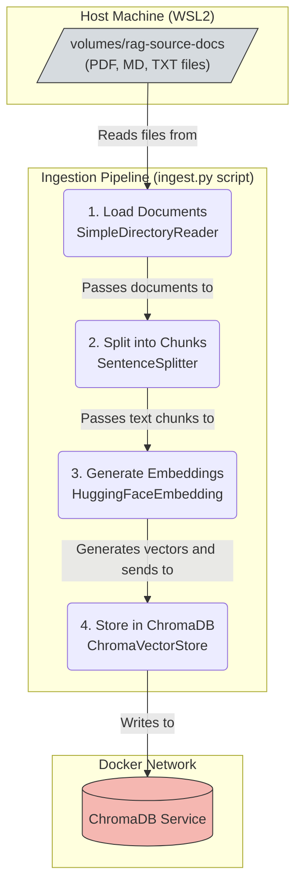

# Scripts for the A-RAG Service

This directory contains utility scripts for development, maintenance, and operational tasks related to the `a-rag-api` service.

## 1. Document Ingestion Script (`ingest.py`)

This is the primary tool for populating the RAG knowledge base.

### 🎯 Purpose & Role

The `ingest.py` script is a command-line utility designed to read documents from various sources, process them, and store them as vector embeddings in ChromaDB vector store. Its core function is to transform unstructured data (like text from PDFs, Markdown files, etc.) into a structured, searchable knowledge base that the RAG agent can use to answer questions.

This process is fundamental to the "Retrieval" part of Retrieval-Augmented Generation (RAG).

### ✨ The Advantage of a Vector Database

A traditional database finds data using exact keyword matches. A **vector database** works differently:

-   It stores the **semantic meaning** of text as a numerical vector (embedding).
-   When a user asks a question, app convert the question into a vector as well.
-   The database then finds the stored text chunks whose vectors are **mathematically closest** to the question's vector (i.e. using cosine similarity).

This allows us to find contextually relevant information even if the user's wording doesn't exactly match the text in our documents, leading to significantly more intelligent and accurate answers.

---

### 🛠️ Core Technologies & Dependencies

This script leverages several key libraries to build the ingestion pipeline. It's important to understand the role of each.

-   **`llama-index`**: This is the main **orchestration framework** for our RAG pipeline. It provides the high-level abstractions (`SimpleDirectoryReader`, `VectorStoreIndex`, `SentenceSplitter`) that connect all the other components together. It's the "glue" that manages the entire data flow from file to vector store.

-   **`llama-index-embeddings-huggingface`**: This is an **integration package** that allows `llama-index` to use embedding models from the Hugging Face ecosystem. We use it to load a powerful, fully offline sentence-transformer model (`all-MiniLM-L6-v2`) that converts text chunks into vector embeddings.

-   **`llama-index-vector-stores-chroma`**: This is another **integration package** that teaches `llama-index` how to communicate with a ChromaDB instance. It provides the `ChromaVectorStore` adapter, which handles the logic of storing, deleting, and querying vectors in our ChromaDB service.

### 🏗️ Ingestion Pipeline Architecture

The script executes a sequential, multi-stage pipeline, orchestrated by `llama-index`.



🚀 Setup and Usage

To run this script, you first need to set up the environment and install the required dependencies.
One-Time Dependency Setup

These commands only need to be run once to prepare your virtual environment.

Run these commands from the services/a-rag/ directory with your venv activated:

Install Core RAG & Integration Packages:

```bash
uv add llama-index llama-index-vector-stores-chroma llama-index-embeddings-huggingface sentence-transformers
```

Install File Readers:
To process different file types, install their corresponding parsers.


-   **Plain Text (`.txt`) & Markdown (`.md`):**
    *   Supported by default. No extra packages needed.
    
-   **Plain Text (`.txt`) & Markdown (`.md`):**
    *   Supported by default. No extra packages needed.

-   **Microsoft Word (`.docx`):**
    ```bash
    uv add python-docx
    ```

-   **Rich Text Format (`.rtf`):**
    ```bash
    uv add pyth
    ```

Running the Ingestion Script

    Place your documents into the volumes/rag-source-docs/ directory in the monorepo root.

    Ensure the ChromaDB service is running:

    ```bash
    # From the monorepo root
    docker compose -f docker-compose.infra.yml up -d chroma
    ```

    Run the script directly, providing the path to your source documents:

    ```bash
    # From the services/a-rag/ directory
    python src/scripts/ingest.py --source-dir ../../volumes/rag-source-docs
    ```

The script will display its progress and log the outcome.
🕵️‍♂️ Verifying Data in ChromaDB

After the ingest.py script successfully completes, you can verify that the data has been added to the ChromaDB container.

    Find the container name:

    ```bash
    docker ps
    ```
    Look for the name tgb-local-chroma.

    Access the Python shell inside the container:
    This is the easiest way to interact with the database using the chromadb client.
    
    ```bash
    docker exec -it tgb-local-chroma python
    ```

    Run Python code to inspect the collection. Your terminal prompt will change to >>>.
    Inside the container's Python shell, execute the following lines one by one:

    ```bash
    # Import the client
    import chromadb

    # Connect to the running Chroma server inside the container
    client = chromadb.Client() 

    # Get our specific collection
    collection = client.get_collection(name="rag_documentation")

    # Count the number of items (vectors) in the collection
    # This number should be greater than zero if ingestion was successful.
    print(f"Total items in collection: {collection.count()}")

    # To exit the Python shell, press Ctrl+D
    ```

    Example output:
    Total items in collection: 42

    Retrieve a few items to see their content:
    This command lets you peek at the actual data stored in the database. It retrieves the first 5 items, including their text content (documents) and metadata.

    ```bash
    results = collection.get(limit=5,
                             include=["documents", "metadatas"]
                            )

    # Pretty-print the results for readability
    import json
    print(json.dumps(results, indent=2))
    ```

    ```json
    {
    "ids": [
        "a1b2c3d4-e5f6-...",
        "b2c3d4e5-f6a7-..."
    ],
    "embeddings": null,
    "metadatas": [
        {
        "file_name": "README.md",
        "file_path": "/path/on/host/volumes/rag-source-docs/README.md",
        ...
        },
        {
        "file_name": "architecture.pdf",
        "file_path": "/path/on/host/volumes/rag-source-docs/architecture.pdf",
        ...
        }
    ],
    "documents": [
        "This is the first text chunk from the README file...",
        "This is the second text chunk from the README file..."
    ],
    "uris": null,
    "data": null
    }
    ```

    How to understand the output:

    "ids": Unique identifiers for each text chunk.

    "metadatas": Contains information about the source of each chunk, most importantly file_name and file_path. You can use this to verify that chunks from your newly added documents are present.

    "documents": The actual text content of the chunk that was vectorized.

## ✅ RAG Pipeline Verification & Testing

After ingesting your documents, it's crucial to verify that the RAG pipeline is working as expected. This involves running an end-to-end test to ensure the system can retrieve relevant context and generate accurate, fact-based answers.

This section provides a baseline test case that you can use to validate the system's performance.

### Step 1: Prepare the Test Environment

Start with a clean slate to ensure reproducible results.

1.  **Stop all running services** and containers.
2.  **Clear existing data:** Delete the contents of `volumes/redis-db/` and `volumes/chroma-db/` to remove any old chat history and vector embeddings.
3.  **Create a test document:** Create a file named `test_document.md` inside the `volumes/rag-source-docs/` directory and paste the sample content below.

#### Sample Test Document (`test_document.md`)

```markdown
# Project Chronicle: The TGB-MicroSuite Platform

## System Overview

The **TGB-MicroSuite** is an advanced, standalone platform designed for creating scalable and intelligent Telegram bots. The architecture is built upon a microservices pattern. The current version of the platform is **Beta 0.2.1**.

## Core Services

The platform consists of three primary services:

1.  **a-rag-api**: The "brain" of the system, built with Python and FastAPI. It exposes a RESTful API on port `8001`.
2.  **tg-gateway**: The communication hub that connects to the Telegram API.
3.  **rag-admin**: The user interface, built with React and TypeScript.

## The RAG Pipeline

Our RAG pipeline uses a combination of open-source technologies:
-   **Vector Store**: **ChromaDB**
-   **Embedding Model**: `all-MiniLM-L6-v2`
-   **LLM**: **Mistral 7B** in GGUF format.

Step 2: Run the Full Stack

    Start Infrastructure: Launch Redis and ChromaDB.
    # From the monorepo root
docker compose -f docker-compose.infra.yml up -d

Ingest Test Document: Populate the ChromaDB with the test document.
# From services/a-rag/ directory
python src/scripts/ingest.py --source-dir ../../volumes/rag-source-docs

Start Application Services: Launch the backend API and the Telegram gateway in separate terminals.
# In Terminal 1 (from services/a-rag/)
arag dev-server

# In Terminal 2 (from services/tg-gateway/)
gateway dev-server 
# (Assuming you have a similar CLI for the gateway)

Step 3: Execute Test Queries

Interact with your bot on Telegram and ask the following questions. Analyze the bot's responses and check the logs of the a-rag-api service to see what context was retrieved.
Category 1: Fact Retrieval

    Query: What is the current version of the TGB-MicroSuite platform?

        Expected Behavior: The answer should contain "Beta 0.2.1". This tests the model's ability to extract precise information.

    Query: Which service is the "brain" of the system and what port does it use?

        Expected Behavior: The answer should mention "a-rag-api" and port 8001. This tests the ability to correlate related facts.

Category 2: Information Synthesis

    Query: List the technologies used in the RAG pipeline.

        Expected Behavior: The answer should list ChromaDB, all-MiniLM-L6-v2, and Mistral 7B. This tests the ability to summarize information from a list.

Category 3: Hallucination & Grounding Check

    Query: Does this project use PostgreSQL as its vector store?

        Expected Behavior: The answer must be "No". It should state that the project uses ChromaDB, based on the provided context. A failure here (e.g., agreeing or being unsure) indicates a "hallucination" problem.

    Query: What is the best way to deploy this to AWS?

        Expected Behavior: The bot should state that this information is not available in its knowledge base (e.g., "I do not have information on AWS deployment based on the provided documents."). This tests the model's ability to recognize the limits of its context.