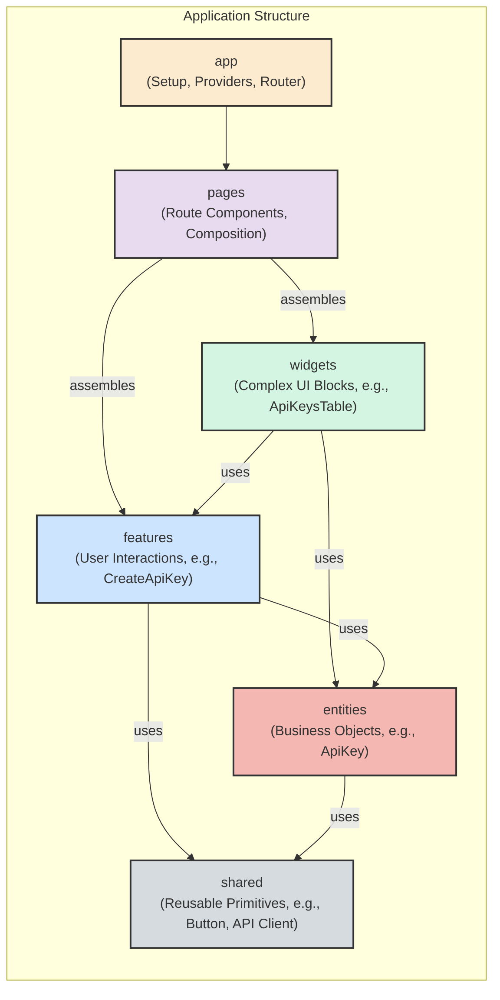

# Service: RAG Admin Dashboard (`rag-admin-ui`)

This document outlines the architectural decisions, design patterns, and core principles for the **RAG Admin Dashboard**. As a critical microservice within the TGB-MicroSuite platform, it serves as the primary user interface for system management.

## 🎯 Service Responsibilities

-   **User Authentication:** Provides a secure login interface for administrators.
-   **API Key Management:** Allows authenticated users to perform full CRUD operations on their API keys.
-   **Dashboard & Analytics:** (Future) A dedicated space for displaying key metrics and operational data about the platform.
-   **LLM Interaction:** (Future) A playground for interacting with the `a-rag-api` service.

---

## 🏛️ Architectural Pattern: Feature-Sliced Design (FSD)

This project strictly adheres to the **Feature-Sliced Design (FSD)** methodology. This architectural choice is fundamental to ensuring the application is scalable, maintainable, and easy for teams to work on in parallel.

### FSD Layers & Component Flow

The diagram below illustrates the FSD hierarchy. The key rule is that a layer can only depend on layers below it, ensuring a unidirectional data flow and low coupling between modules.

GNORE_WHEN_COPYING_END

    src/shared: The foundation. Contains code with no project-specific logic (UI kit, helpers, API client instance).

    src/entities: Core business concepts like User or ApiKey, including their data types and API interaction hooks.

    src/features: User-facing business logic, such as CreateApiKey or AuthByCredentials.

    src/widgets: Compositional blocks like Header or ApiKeysTable that assemble features and entities.

    src/pages: Route entry points that compose widgets to form a complete view.

    src/app: The root that initializes the entire application, including providers and routing.

🛠️ Key Technical Decisions & Rationale

Our technology stack was chosen to maximize developer productivity, code quality, and application performance.

    TypeScript over JavaScript: Non-negotiable for a large-scale application. Static typing provides compile-time safety, superior IntelliSense, and serves as living documentation.

    TanStack Query (React Query) for Server State: We strictly separate server cache from client UI state. TanStack Query is the single source of truth for all data fetched from the a-rag-api. It expertly handles caching, refetching, and loading/error states, drastically reducing boilerplate and improving UX.

    MUI for Component Library: Material-UI provides a comprehensive suite of high-quality, accessible React components, allowing us to build a consistent and professional-looking UI quickly.

    Vite for Build Tooling: Chosen for its exceptional developer experience (DX), including near-instant Hot Module Replacement (HMR) and fast, efficient production builds.

    ESLint & Prettier for Code Quality: An automated combination to enforce consistent coding style and catch potential errors early. Code is auto-formatted and fixed on save.

🚀 Local Development

This service is designed to be developed locally in an isolated Node.js environment.
1. Prerequisites

    Node.js v18+

    npm (usually comes with Node.js)

2. Environment Setup

All commands should be run from this directory (services/rag-admin/).

    Install Dependencies:
    This command reads package.json and installs all required packages into the node_modules directory.
    npm install

    Configure Environment Variables:
The application requires the URL of the backend API. Copy the example file to create your local configuration.
    cp .env.example .env.local
    Now, edit .env.local to ensure VITE_API_BASE_URL points to your running a-rag-api instance (e.g., http://localhost:8000).

3. Running the Development Server

    Start the server with hot-reload:
    npm run dev
    The application will be available at http://localhost:5173. The server will automatically reload when you make changes to the code.

4. Code Quality Checks

    Run Linter:
    To manually check for code quality issues, run:
    npm run lint
    Build for Production:
To test a production build locally, run:

    npm run build
    This will create an optimized, static build in the dist/ directory.