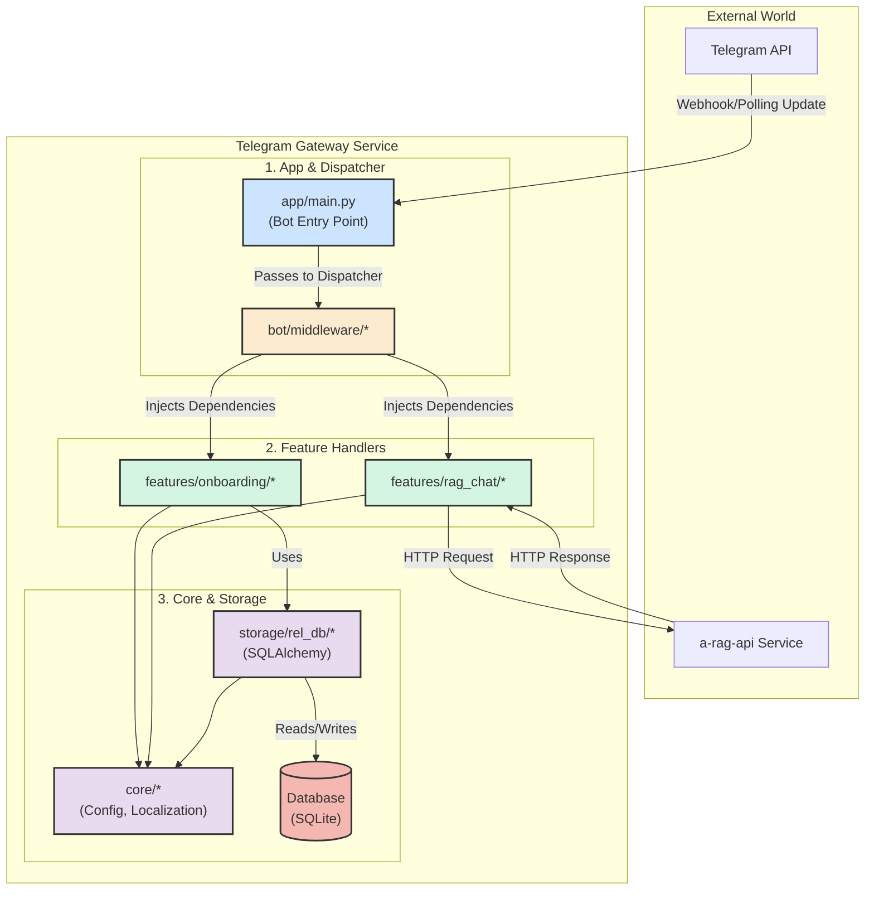

# Service: Telegram Gateway (`tg-gateway-service`)

This directory contains the source code for the **Telegram Gateway Service**. It is a lightweight, asynchronous Telegram bot built with **Aiogram 3.x** that serves as the primary entry point for all user interactions originating from the Telegram platform.

## 🎯 Service Responsibilities

This service acts as a "thin" gateway, with its responsibilities strictly limited to:

1.  **Handling Telegram API Updates:** Receiving all incoming events from Telegram, such as messages, commands, and callbacks.
2.  **User Onboarding:** Greeting new users and creating a basic client profile in its local database.
3.  **Routing to Backend:** Acting as a proxy by forwarding user text queries to the `a-rag-api` service for processing.
4.  **Delivering Responses:** Returning the processed responses from the A-RAG system back to the user in Telegram.

The service deliberately **avoids** complex business logic, which is delegated entirely to the `a-rag-api`.

---

## 🏛️ Architectural Design

The service follows a clean, domain-driven structure, mirroring the principles of the `a-rag-api` but adapted for an event-driven bot architecture.

### Core Principles

-   **Feature-Sliced Structure:** The core bot logic is organized by business features (e.g., `onboarding`, `rag_chat`) located in `src/bot/features/`. Each feature is a self-contained "slice" with its own router and handlers.
-   **Dependency Injection:** Shared services like the database adapter and localization service are initialized once and injected into handlers via Aiogram's `workflow_data` and middleware, promoting loose coupling and high testability.
-   **Clear Separation of Concerns:** The code is strictly layered. Handlers (`handler.py`) contain business logic, routers (`router.py`) handle event filtering, and the application entry point (`app/main.py`) orchestrates the assembly.

### Internal Component Flow

This diagram illustrates how a Telegram update is processed by the service.

🛠️ Local Development

This service is designed to be developed locally in an isolated virtual environment managed by uv.
1. Prerequisites

    Python 3.12+

    uv installed (pip install uv)

2. Environment Setup

All commands should be run from this directory (services/tg-gateway/).

    Create & Activate Virtual Environment:

    uv venv
# For Windows: .\.venv\Scripts\Activate.ps1
# For macOS/Linux: source .venv/bin/activate

Install All Dependencies:
This command installs both production and development (ruff, pytest) dependencies.

uv pip install -e ".[dev]"

    You must provide your BOT_TOKEN in the .env file for the bot to start.

3. Running the Bot

We use a custom CLI tool, gateway, defined in pyproject.toml for all common tasks.

    Start the bot:
    gateway start

        The bot will start polling for updates from Telegram. Press Ctrl+C to stop it gracefully.

4. Database Migrations

Database schema changes are managed by Alembic.

    Apply all migrations:
    This should be done after setting up the environment for the first time or after pulling changes that include new migrations.
    gateway migrate

    Create a new migration:
After changing your SQLAlchemy models in src/storage/rel_db/models.py, generate a new migration script:
gateway revision -m "your_descriptive_migration_message"

    Always review the generated script before applying it.

5. Running Tests & Code Quality

    Run linter and formatter checks:
    ruff check . && ruff format --check .

    Run tests (once implemented):
    gateway test